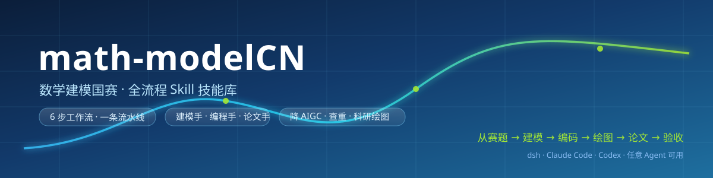
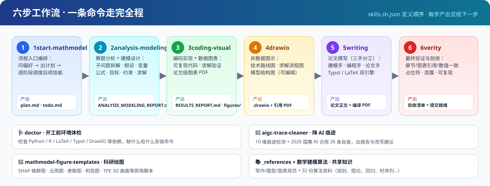
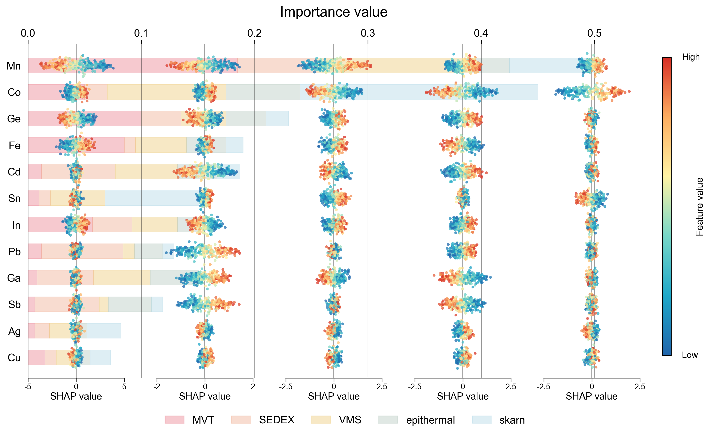
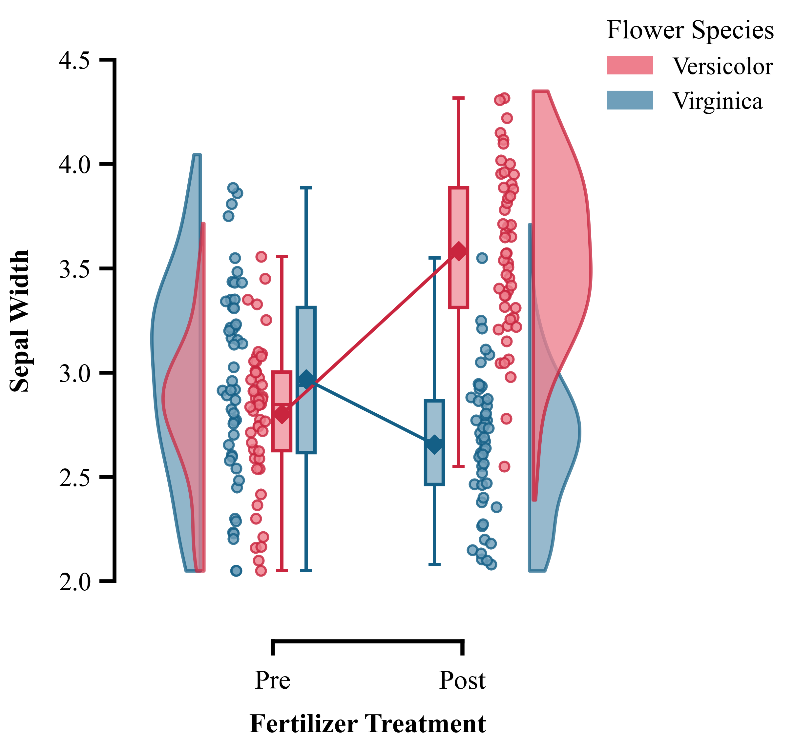
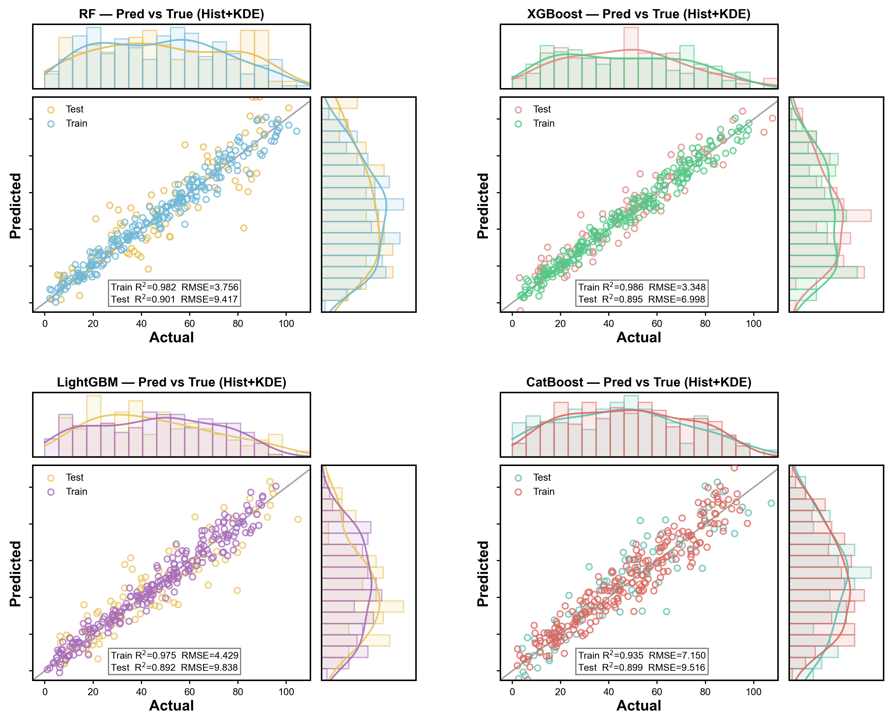
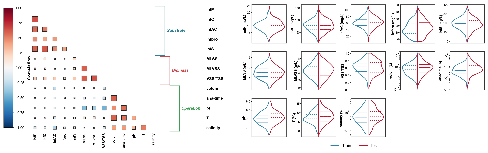
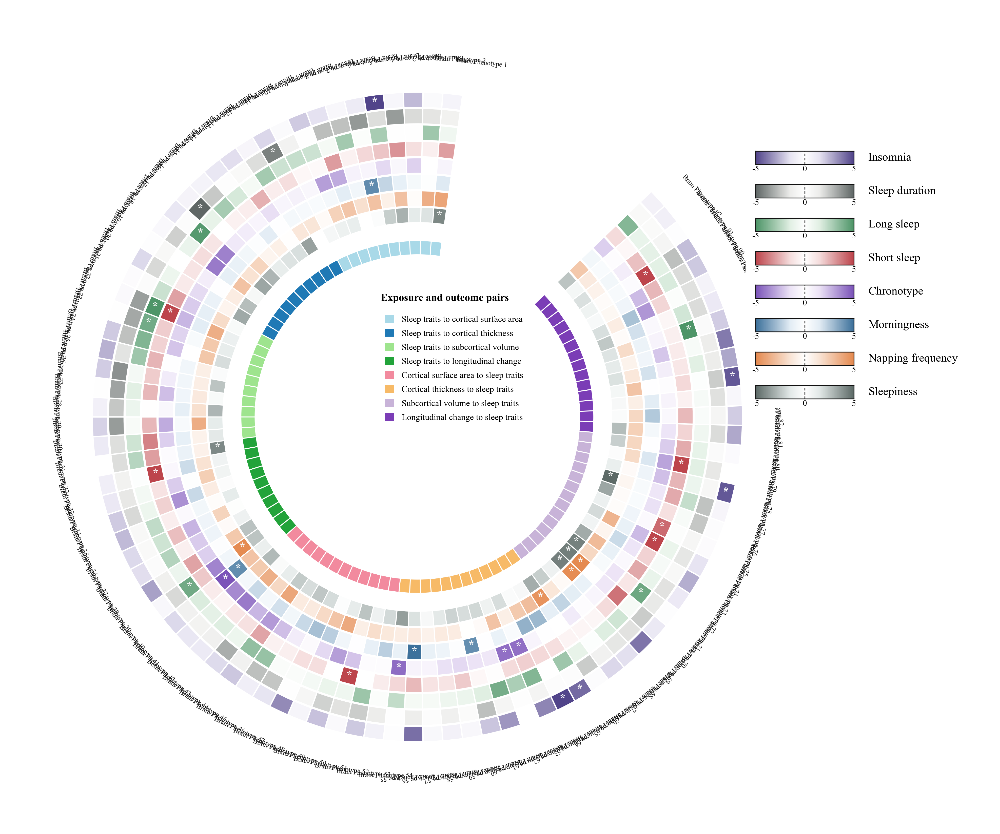
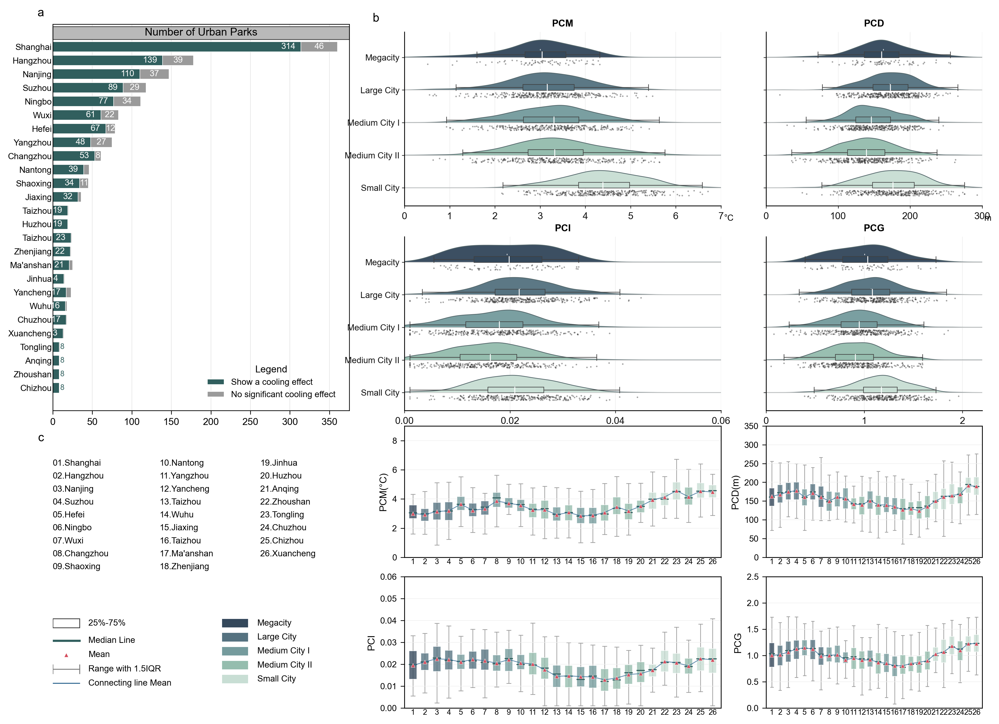

<div align="center">
  
</div>

<div align="center">


**把「数学建模国赛」从赛题到提交，变成一条可复用的技能流水线。**

从赛题分析、建模设计、编码求解、科研绘图，到论文撰写、降 AIGC、查重与验收 —— 每一步都有专门的 Skill 兜底，
让 Agent 不再"看起来什么都会、真做起来到处漏"，而是照着流程把一篇能打的论文做出来。

[📖 六步工作流](#-六步工作流) · [🧰 技能总览](#-技能总览) · [📦 快速开始](#-快速开始) · [🎨 绘图画廊](#-科研绘图模板画廊) · [📚 算法资料库](#-算法资料库)

</div>

---

## 💡 它解决什么问题？

<table>
<tr>
<td width="33%" valign="top">

### 🧭 流程不清 → 一条流水线
赛题一拿到就闷头写代码，写到一半发现假设没定义、变量没统一。
**6 步工作流**把"先想清楚再动手"固化下来：每步产出交给下一步，文件名叫什么、放哪里都定死。

</td>
<td width="33%" valign="top">

### 📉 AI 味太重 → 10 维体检
一键生成的论文图表同质化、过渡词成灾、数据过于完美，评委一眼看出。
**`aigc-trace-cleaner`** 提供 10 维痕迹检测 + **2026 国赛 AI 合规 26 条自查**，出报告、给改法。

</td>
<td width="33%" valign="top">

### 🎨 图表不够看 → 现成模板
折线柱状图撑不起论文。**11 套科研级绘图模板**（SHAP 蜂群、云雨图、泰勒图、和弦图、3D 曲面…）
直接跑 `make_*.py` 出可发表级 PDF。

</td>
</tr>
</table>

---

## 🚀 六步工作流

<div align="center">
  
</div>

| 步骤 | 技能 | 做什么 | 关键产出 |
|:---:|---|---|---|
| **1** | `1start-mathmodel` | 流程入口：询问你的偏好，规划任务清单，按阶段调度后续技能 | `plan.md` · `todo.md` |
| **2** | `2analysis-modeling` | 读题面与附件 → 子问题拆解、数据理解、假设预检、变量定义、模型公式、目标函数、约束、求解策略 | `ANALYSIS_MODELING_REPORT.md` |
| **3** | `3coding-visual` | 按建模报告写**可复现代码**、运行求解、验证约束，输出论文可用图表 | `RESULTS_REPORT.md` · `figures/*.pdf` |
| **4** | `4drawio` | 非数据型图示：技术路线图、子问题求解流程图、模型结构图、数据处理流程图 | `.drawio` + 引用用 PDF |
| **5** | `5writing` | 论文撰写（建模手 / 编程手 / 论文手三手分工），**Typst 与 LaTeX 双引擎** | 论文正文 + 编译 PDF |
| **6** | `6verity` | 最终验证验收：章节数量、标题顺序、图表引用、数值一致性、占位符、内部文件泄露、参考文献、代码可复现性、编译与提交就绪 | 验收清单 |

> ℹ️ `5writing` 在 `main` 分支为占位文件，完整内容在 **`5writing-CN` 分支**（对应 PR #1）。克隆后按需切换即可。

<details>
<summary><b>为什么是"六步"而不是"一个大提示词"？</b>（点开看设计思路）</summary>

<br>

| 大提示词的问题 | 分步技能怎么解 |
|---|---|
| 上下文一次塞太多，模型抓不住重点 | 每步只加载当前阶段的规范（`_references` 按需读取） |
| 中间结果没落盘，改一处全篇重来 | 每步产出固定命名的报告文件，可回滚、可续接 |
| 建模与编码脱节，代码和论文公式不一致 | 步骤 3 强制以 `ANALYSIS_MODELING_REPORT.md` 为唯一输入 |
| 图表风格杂乱、图像不成体系 | 步骤 4 统一图示规范，步骤 3 统一出图管线 |
| 交稿前才发现占位符/引用错 | 步骤 6 机械校验 + 人工复核清单 |

</details>

---

## 🧰 技能总览

### 工作流技能（按顺序使用，顺序定义在 `skills.sh.json`）

| 技能 | 说明 |
|---|---|
| `1start-mathmodel` | 竞赛工作流入口：问偏好、出计划、逐阶段调度后续技能 |
| `2analysis-modeling` | 赛题分析与建模设计合并阶段 |
| `3coding-visual` | 编程实现与数据图表生成 |
| `4drawio` | 非数据型图示绘制（DrawIO） |
| `5writing` | 论文撰写（Typst / LaTeX，含查重与降重规范） |
| `6verity` | 最终验证与验收 |

### 工具技能（按需调用）

| 技能 | 说明 |
|---|---|
| 🩺 `doctor` | **环境检查与安装向导**：检查全流程依赖（Python / R / LaTeX / Typst / DrawIO 等），缺什么给什么安装命令，确认后执行 |
| 🧹 `aigc-trace-cleaner` | **降 AI 痕迹**：10 维痕迹检测（词汇/句式/段落/逻辑/人味/数据表述/图表/结构/引用/整体 AI 感）+ **2026 国赛 AI 合规 6 维 26 条自查**，输出带定位与改写示例的报告 |
| 📊 `skill-prework` | **数据预处理（R 语言）**：分布探查 → 清洗 → 变换 → 编码 → 特征 → 平稳性 → 共线性降维 → 划分 → 验证，10 步全流程或轻量局部模式 |
| 🎨 `mathmodel-figure-templates` | **科研绘图模板**：11 套即跑脚本 + 预览图（见下方画廊） |
| 🔍 `02_find-skills` | 场景/关键词双模式技能发现，六层联合搜索并一键安装 |

### 文档与论文技能（已内置社区优质技能）

| 技能 | 说明 |
|---|---|
| 📝 `01_docx-cn` | Word 文档处理：创建、读取、编辑 `.docx`，支持格式化、表格、图片、批注与修订 |
| 🎓 `04_chinese-thesis-workbench` | 中文本科毕业论文 / 毕设工作台：模板对齐、文献矩阵、图表注册、AIGC 风格治理、DOCX 交付 |

### 共享知识库

| 目录 | 内容 |
|---|---|
| `_references` | 写作规范、题型防错速查、图表规范 —— 其他技能按需读取，无需单独触发 |
| `数学建模算法` | **32 份算法资料**（PDF），见下方资料库清单 |
| `数学建模竞赛网上资源.md` | 竞赛官网、工具官网与算法学习资源链接整理 |

> 🤖 配套的 **数学建模 Workbench 自定义 Agent**（建模手 / 编程手 / 论文手 三角色分工流程）可显著减少提示词输入；
> 目前它不在 `main` 分支的目录树中，见下方路线图——欢迎把它一并加入仓库，做到"克隆即用"。

---

## 📦 快速开始

### 方式一：dsh（DeepSeek Harness）

```bash
git clone https://github.com/a-linklist-being-initialized/math-modelCN.git
cd math-modelCN

# 把技能挂进 dsh 技能目录（用户级，所有会话可见）
# Windows PowerShell
Copy-Item -Recurse .\1start-mathmodel,.\2analysis-modeling,.\3coding-visual,.\4drawio,.\6verity,.\doctor,.\aigc-trace-cleaner,.\mathmodel-figure-templates,.\skill-prework "$env:DSH_HOME\skills\"
# macOS / Linux
cp -r ./{1start-mathmodel,2analysis-modeling,3coding-visual,4drawio,6verity,doctor,aigc-trace-cleaner,mathmodel-figure-templates,skill-prework} "$DSH_HOME/skills/"
```

> 创建者使用的大模型为 **DeepSeek Harness v4.1 pro**，但本库**不绑定 dsh**。

### 方式二：其他 Agent（Claude Code / Codex / Cursor / 任意支持 Skill 的 Agent）

每个技能目录都是自包含的：`SKILL.md`（入口说明）+ `references/`（细节）+ `scripts/`（脚本）。
把目录放进该 Agent 的技能目录，或**直接把 `SKILL.md` 交给 Agent 读取**即可安装使用。

### 方式三：先把环境体检做了

```
请运行 doctor 技能，检查我的数学建模环境
```

`doctor` 会逐项检查 Python、R、LaTeX、Typst、DrawIO 等依赖，并给出缺失项的安装命令。

<details>
<summary><b>推荐使用姿势（一次完整建模的对话流）</b></summary>

<br>

```text
我：开始数学建模，赛题和附件在 ./problem/ 目录

Agent：[1start-mathmodel] 已生成 plan.md / todo.md，进入赛题分析阶段
       [2analysis-modeling] 已产出 ANALYSIS_MODELING_REPORT.md（4 个子问题、6 条假设、模型与约束齐备）
       [3coding-visual] 已产出可复现代码 + RESULTS_REPORT.md + figures/*.pdf（12 张图）
       [4drawio] 已产出技术路线图与流程图（可编辑 .drawio + 引用 PDF）
       [5writing] 已按论文手规范撰写正文（Typst 引擎编译通过）
       [6verity] 验收：章节顺序 ✔ 图表引用 ✔ 数值一致性 ✔ 无占位符 ✔ 提交就绪

我：帮我把 AIGC 痕迹降下来
Agent：[aigc-trace-cleaner] 10 维检测完成：C 级（约 45%），主要问题为图题工具化、人味不足…
```

</details>

---

## 🎨 科研绘图模板画廊

**11 套即用模板**：`mathmodel-figure-templates/scripts/` 下每个 `make_*.py` 独立可跑，输出论文级 PDF。

<table>
<tr>
<td width="33%" align="center"><br><sub><b>多分类 SHAP 蜂群柱状组合图</b></sub></td>
<td width="33%" align="center"><br><sub><b>配对云雨图</b></sub></td>
<td width="33%" align="center"><br><sub><b>交叉验证 ROC（含置信区间）</b></sub></td>
</tr>
<tr>
<td align="center"><br><sub><b>泰勒图</b></sub></td>
<td align="center"><br><sub><b>相关矩阵组合图</b></sub></td>
<td align="center"><br><sub><b>预测值-真实值边缘分布图</b></sub></td>
</tr>
<tr>
<td align="center"><br><sub><b>TPE 调参 3D 曲面</b></sub></td>
<td align="center"><br><sub><b>下三角相关矩阵半边小提琴图</b></sub></td>
<td align="center"><br><sub><b>分组环形热图</b></sub></td>
</tr>
<tr>
<td align="center"><br><sub><b>Nature 和弦图</b></sub></td>
<td align="center"><br><sub><b>城市公园降温组合图</b></sub></td>
<td align="center"><sub>更多模板持续增加中…<br>欢迎 PR 你的图表 👏</sub></td>
</tr>
</table>

---

## 📚 算法资料库

`数学建模算法/` 收录 **32 份**成体系的中文算法资料（PDF），覆盖国赛常见题型：

| 类别 | 资料 |
|---|---|
| **规划与优化** | 线性规划 · 非线性规划 · 整数规划 · 目标规划 · 动态规划 · 现代优化算法 · 变分法模型 |
| **图论与网络** | 图与网络 · 对策论 · 排队论 · 存贮论 · 作业计划 |
| **统计与数据分析** | 数据的统计描述和分析 · 回归分析 · 偏最小二乘回归分析 · 方差分析 · 多元分析 · 插值与拟合 · 时间序列模型 |
| **微分方程与动态系统** | 微分方程建模 · 常微分方程的解法 · 偏微分方程的数值解 · 差分方程模型 · 稳定状态模型 · 马氏链模型 |
| **不确定性与智能方法** | 灰色系统理论及其应用 · 模糊数学模型 · 神经网络模型 · 支持向量机 · 层次分析法 |
| **应用专题** | 经济与金融中的优化问题 · 生产与服务运作管理中的优化问题 |

---

## 📁 目录结构

```text
math-modelCN/
├── 1start-mathmodel/                 # ① 流程入口（计划与调度）
├── 2analysis-modeling/               # ② 赛题分析 + 建模设计
├── 3coding-visual/                   # ③ 编码实现 + 数据图表
├── 4drawio/                          # ④ 非数据图示
├── 5writing                          # ⑤ 论文撰写（内容在 5writing-CN 分支）
├── 6verity/                          # ⑥ 验证与验收
├── doctor/                           # 🩺 环境体检
├── aigc-trace-cleaner/               # 🧹 降 AIGC 痕迹 + 国赛 AI 合规自查
├── skill-prework/                    # 📊 数据预处理（R 语言，10 步）
├── mathmodel-figure-templates/       # 🎨 科研绘图模板（11 套 + 预览图）
│   ├── scripts/                      #    make_*.py 即跑脚本
│   ├── assets/previews/              #    11 张预览图
│   └── references/
├── _references/                      # 📚 共享规范（写作 / 题型 / 图表）
├── 数学建模算法/                      # 📚 32 份算法资料 PDF
├── 01_docx-cn__docx-cn/              # 📝 Word 文档处理技能
├── 02_find-skills__find-skills/      # 🔍 技能发现
├── 04_chinese-thesis-workbench__*/   # 🎓 中文本科论文工作台
├── 数学建模竞赛网上资源.md
└── skills.sh.json                    # 技能分组清单
```

---

## ❓ 常见问题

<details>
<summary><b>必须用 dsh 吗？</b></summary>
不必须。技能目录是自包含的（<code>SKILL.md</code> + <code>references/</code> + <code>scripts/</code>），Claude Code、Codex、Cursor 等支持 Skill / 可读取说明文件的 Agent 都能装。创建者使用的是 DeepSeek Harness v4.1 pro。
</details>

<details>
<summary><b>技能太多，会互相打架吗？</b></summary>
工作流技能按 <code>1→6</code> 顺序使用，由 <code>1start-mathmodel</code> 统一调度；工具技能按需触发（<code>doctor</code>、<code>aigc-trace-cleaner</code> 等）。<code>_references</code> 是共享知识，不单独触发，避免重复加载。
</details>

<details>
<summary><b>降 AIGC 能保证通过检测吗？</b></summary>
不能承诺"过检测"。它做的是<b>降低可识别痕迹 + 补齐官方硬指标</b>：10 维痕迹检测给出定位与改写示例，合规自查按 2026 国赛 6 维 26 条逐项判"合格 / 存在问题 / 待核实"。数据、公式、结论一律不动（改数据属学术不端）。
</details>

<details>
<summary><b>绘图模板怎么用？</b></summary>
进入 <code>mathmodel-figure-templates/scripts/</code> 直接运行，例如：<br>
<code>python make_paired_raincloud.py</code> → 输出云雨图 PDF。<br>
脚本相互独立，改数据路径与字段名即可套用到自己的题目。
</details>

<details>
<summary><b>可以只用其中一两个技能吗？</b></summary>
可以。例如只想降 AI 痕迹：把 <code>aigc-trace-cleaner/</code> 装进技能目录即可；只想画图：装 <code>mathmodel-figure-templates/</code>。
</details>

---

## 🗺️ 路线图

- [x] 六步工作流技能（1start → 6verity）
- [x] 环境体检 `doctor`
- [x] 降 AIGC + 2026 国赛 AI 合规自查
- [x] 数据预处理（R / Python）
- [x] 科研绘图模板 11 套
- [x] 32 份算法资料库
- [ ] **把 Workbench 自定义 Agent 纳入 `main` 分支**（建模手 / 编程手 / 论文手，克隆即用）
- [ ] 完整示例题目：从赛题到提交的全流程产物留档
- [ ] 更多绘图模板（生存分析、贝叶斯后验、网络图、地图可视化）
- [ ] 英文版 README 与技能说明
- [ ] 一键安装脚本（Windows / macOS / Linux）

---

## 🤝 贡献与致谢

- **欢迎 PR**：新增绘图模板、修正笔误、补充算法资料、分享优秀论文范例都很有价值。
- 提交技能时请确保：目录自带 `SKILL.md`，且 frontmatter 的 `name` 为小写连字符格式。
- 感谢所有开源社区与科研开发者：本库中的部分技能（`01_docx-cn`、`02_find-skills`、`04_chinese-thesis-workbench`）来自社区优质项目，版权归原作者所有。

## 📄 使用声明

本仓库仅供**学习与竞赛交流**使用。

- 数学建模竞赛对 AI 工具有明确规定：**核心建模与核心写作应由参赛者主导**，使用 AI 须按当届要求声明。请务必核对官方规则。
- 库内算法资料与论文资源均为互联网公开整理，如涉版权问题请联系删除。
- 本仓库当前**未声明开源许可证**；建议补充 `LICENSE` 文件，便于他人合规使用。

<div align="center">

### ⭐ 如果这套技能帮你少熬了几个通宵

给个 Star 就是最好的支持 —— 也让更多建模人少走弯路 🚀

[](https://star-history.com/#a-linklist-being-initialized/math-modelCN&Date)

</div>
